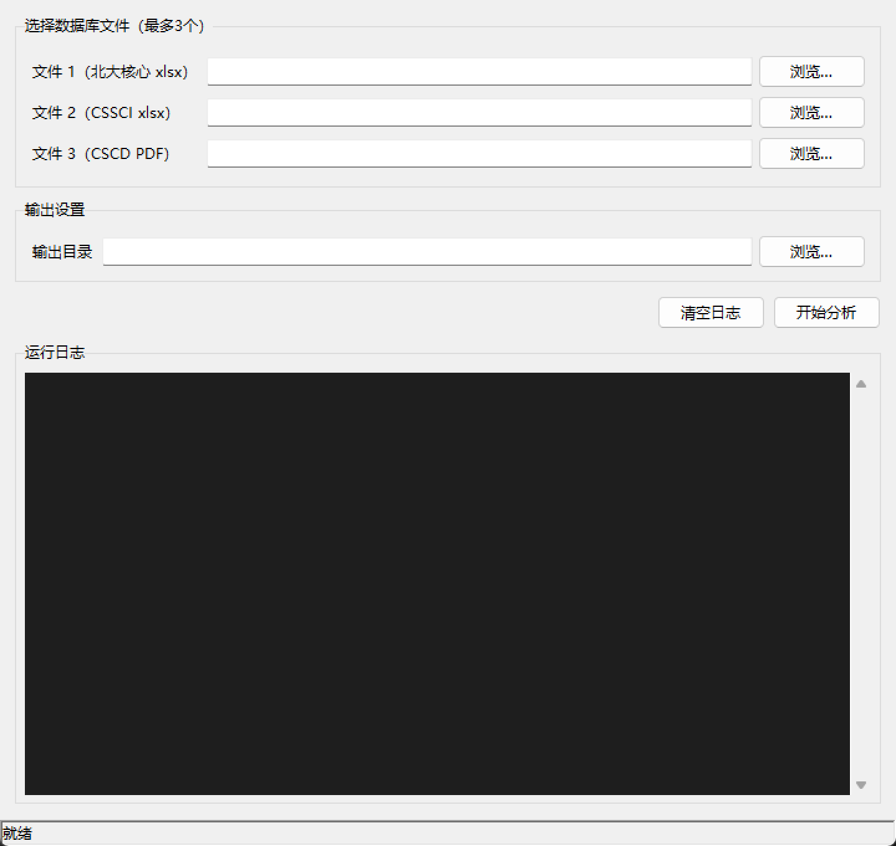

# 期刊数据库交集分析工具

用于分析多个期刊来源文件中的收录交集，并导出为 Excel。当前版本已不局限于固定三库，支持 1 到 10 个输入文件、专用解析器与通用解析器混合处理。

---

## 功能概述

- 支持命令行与 Tkinter GUI 两种使用方式
- 命令行支持 `1~10` 个输入文件，GUI 支持 `2~10` 个输入文件
- 支持专用来源识别：北大核心、CSSCI、CSCD、中国科技核心期刊
- 支持通用文件解析：`xlsx`、`xls`、`csv`、`txt`、`pdf`、`docx`、`doc`、`rtf`、`html`、`htm`
- 对刊名进行标准化处理，按标准键计算全交集、两两交集、多库交集和单库独有
- 导出多工作表 Excel，支持“简洁模式”和“完整模式”
- 内置本地缓存，相同文件再次运行时可跳过重复解析
- 支持可选 LLM 增强，用于通用解析结果的补充抽取与名称归一
- 通用 PDF 解析支持 OCR 回退，依赖本机 `tesseract`
- 可通过 `build.bat` 打包为 Windows 单文件 EXE

---

## 支持的输入类型

### 专用解析器

程序会优先根据文件名关键词匹配专用解析器：

| 来源 | 格式 | 文件名关键词示例 |
|---|---|---|
| 北大核心 | `.xlsx` / `.xls` | `北大`、`beida` |
| CSSCI | `.xlsx` / `.xls` | `cssci`、`社会科学引文` |
| CSCD | `.pdf` | `cscd`、`科学引文数据库` |
| 中国科技核心期刊 | `.pdf` | `中国科技核心期刊`、`中国科技`、`科技核心` |

### 通用解析器

如果未命中特定来源，会按扩展名走通用解析流程：

- Excel：`.xlsx`、`.xls`
- CSV：`.csv`
- 文本：`.txt`
- PDF：`.pdf`
- Word：`.docx`、`.doc`、`.rtf`
- HTML：`.html`、`.htm`

---

## 输出结果

程序会生成一个 Excel 文件，常见工作表如下：

| 工作表 | 说明 |
|---|---|
| `统计摘要` | 各来源有效期刊数、全交集、组合交集、单库独有统计 |
| `全交集` | 所有输入来源共同收录的期刊 |
| `两两交集` | 仅出现在两个来源中的期刊 |
| `多库交集` | 仅出现在三个及以上、但未覆盖全部来源的期刊 |
| `单库独有` | 仅出现在单一来源中的期刊 |

当导出模式为 `full` 时，还会为每个具体来源组合单独生成工作表。

---

## 项目结构

```text
Journal_database_intersection/
├── core/
│   ├── config.py            # 运行时配置、LLM 配置读写
│   ├── exporter.py          # Excel 导出
│   ├── ingestion.py         # 文件解析入口与缓存集成
│   ├── llm_client.py        # OpenAI 兼容接口客户端
│   ├── llm_extractor.py     # LLM 增强抽取与归一
│   ├── matcher.py           # N 库交集计算
│   ├── models.py            # 数据模型
│   ├── normalizer.py        # 刊名标准化
│   ├── ocr_service.py       # PDF OCR 支持
│   └── parser_registry.py   # 解析器注册与分发
├── parsers/
│   ├── base.py
│   ├── beida.py
│   ├── cssci.py
│   ├── cscd.py
│   ├── zhongguo_kj.py
│   ├── excel_parser.py
│   ├── csv_parser.py
│   ├── txt_parser.py
│   ├── pdf_parser.py
│   ├── docx_parser.py
│   ├── doc_parser.py
│   └── html_parser.py
├── data/
│   └── cache.json           # 解析缓存
├── docs/
│   └── gui_preview.png
├── logs/                    # 运行日志目录
├── cache_store.py           # 缓存读写
├── logger_setup.py          # 日志初始化
├── main.py                  # CLI 入口
├── gui.py                   # GUI 入口
├── build.bat                # Windows 打包脚本
└── requirements.txt         # Python 依赖
```

---

## 环境要求

- Python 3.10+
- Windows（GUI 与 `build.bat` 面向 Windows；核心逻辑本身以 Python 实现）

---

## 安装依赖

```bash
python -m venv venv
venv\Scripts\activate
pip install -r requirements.txt
```

当前 `requirements.txt` 包含：

```text
openpyxl>=3.1.0
PyMuPDF>=1.23.0
```

说明：

- 若需打包，还需额外安装 `pyinstaller`
- 若需 PDF OCR 回退，还需在系统中安装 `tesseract`

---

## 运行方式

### 命令行

```bash
python main.py <文件1> [文件2] ... <输出Excel路径>
```

- 输入文件数量：`1~10`
- 最后一个参数必须是输出 Excel 路径

示例：

```bash
python main.py "北大核心目录.xlsx" "CSSCI目录.xlsx" "结果.xlsx"
python main.py "来源1.csv" "来源2.pdf" "来源3.docx" "期刊交集分析结果.xlsx"
```

### GUI

```bash
python gui.py
```

GUI 特点：

- 至少选择 `2` 个文件，最多 `10` 个
- 可选择输出目录；若不填写，默认输出到第一个输入文件所在目录
- 支持“简洁模式”和“完整模式”
- 可填写 DeepSeek API Key，保存到运行目录下的 `conf_Journal_database_intersection.conf`
- 分析完成后可直接打开输出文件所在位置



---

## LLM 配置

GUI 会将 LLM 配置保存到：

```text
conf_Journal_database_intersection.conf
```

默认配置项包括：

- `enabled`
- `api_key`
- `base_url`，默认 `https://api.deepseek.com`
- `model`，默认 `deepseek-chat`

说明：

- 未填写 API Key 时，程序仅使用规则解析
- LLM 增强当前主要作用于通用解析器结果，不影响专用解析器的基础流程

---

## 缓存与日志

- 解析缓存文件：`data/cache.json`
- 运行日志目录：`logs/`

如需强制重新解析，可删除缓存文件后重试。

---

## 测试与校验

当前仓库内未提供现成的自动化测试、`pytest` 配置、lint 或 type check 脚本。

建议使用以下方式做基本验证：

### 1. 语法检查

```bash
python -m compileall .
```

### 2. 命令行冒烟测试

```bash
python main.py "样例1.xlsx" "样例2.pdf" "输出结果.xlsx"
```

### 3. GUI 冒烟测试

```bash
python gui.py
```

重点检查：

- 文件能否被识别到正确解析器
- 是否能正常生成 Excel
- `统计摘要` 与交集工作表是否符合预期
- 日志中是否出现解析失败或 OCR / LLM 相关异常

---

## 打包

项目已提供 Windows 打包脚本：

```bat
build.bat
```

脚本会执行以下流程：

1. 进入项目根目录
2. 激活 `venv\Scripts\activate.bat`
3. 自动安装 `pyinstaller`
4. 以 `gui.py` 为入口打包为单文件 GUI 程序

打包命令核心参数包括：

- `--onefile`
- `--windowed`
- `--name "期刊交集分析工具"`
- `--add-data "data;data"`

打包产物位于：

```text
dist\期刊交集分析工具.exe
```

如果打包前尚未创建虚拟环境，请先完成：

```bash
python -m venv venv
venv\Scripts\activate
pip install -r requirements.txt
pip install pyinstaller
```

---

## 注意事项

- 交集计算基于标准化后的刊名键，不是模糊匹配
- 当多个输入文件来源名重复时，程序会自动追加编号区分
- GUI 最少需要 2 个文件；命令行最少 1 个文件
- 通用 PDF OCR 依赖系统安装的 `tesseract`
- 本工具不附带任何数据库原始数据文件

---

## License

MIT
